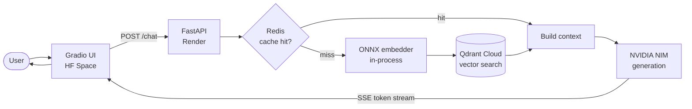
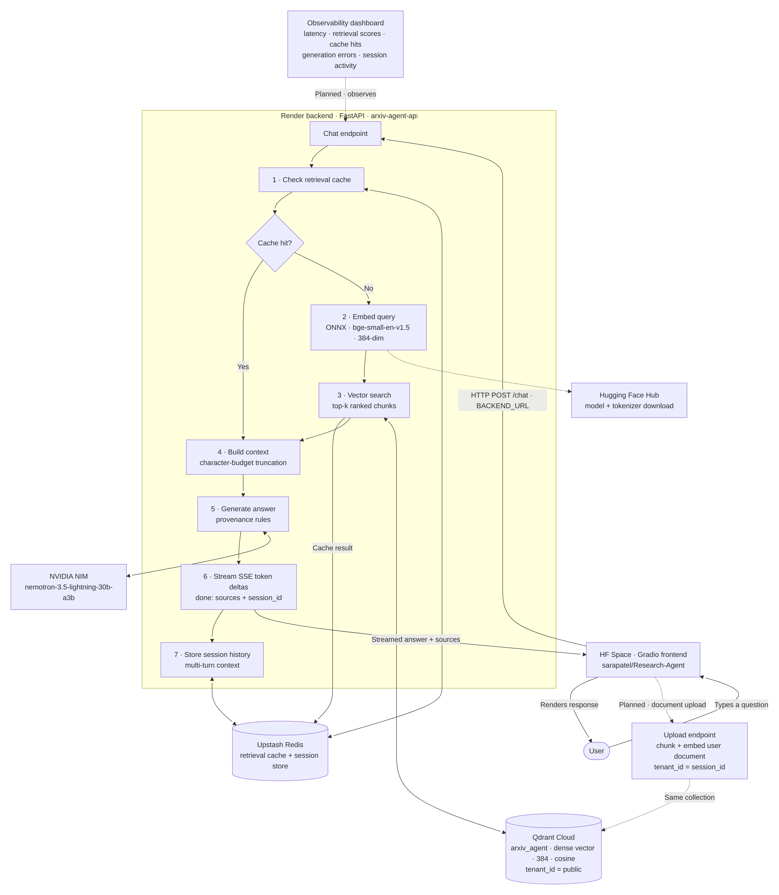
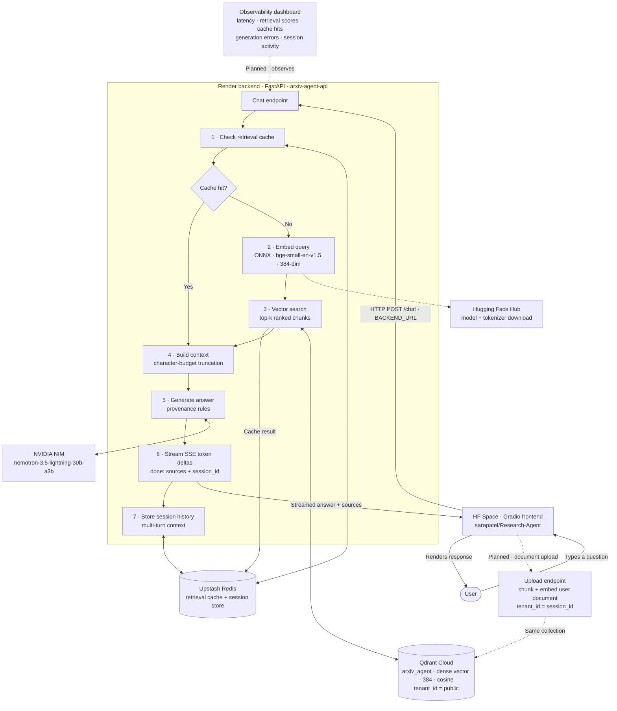

# Arxiv Agent

> Retrieval-augmented Q&A over a curated corpus of arXiv NLP/LLM papers, with a self-hosted embedder and streamed, source-attributed answers.


---

## Live demo

**[Try it on Hugging Face Spaces →](https://huggingface.co/spaces/sarapatel/Research-Agent)**

---

## Architecture



### Full request-time flow

[](docs/architecture.png)

<sub>Click the diagram to open it full size.</sub>

<details>
<summary>Mermaid source for the diagram above</summary>



</details>

---

## Features

- **Grounded Q&A** over seven foundational arXiv papers (Transformers, BERT, RAG, MRKL, Mistral 7B, LLM-as-a-Judge, RAG survey).
- **Token-by-token streaming** to the browser over Server-Sent Events.
- **Multi-turn conversations** backed by a Redis session store with a rolling one-hour TTL.
- **Source attribution** built from retrieved chunk metadata, not parsed out of model text.
- **Explicit provenance split** — corpus-grounded answers cite papers; general-knowledge answers are labelled as such and cite nothing.
- **Self-hosted embeddings** running in-process via ONNX Runtime — no third-party embedding API in the request path.
- **Two-layer caching** keyed on corpus version, embedder fingerprint and generation prompt/model hash, so a re-ingest or prompt change invalidates automatically.
- **Multi-tenant vector store** — every point carries a `tenant_id`, indexed for tenant-local search.
- **Resilient generation** — per-attempt timeouts, retry on transient failures, and a distinct SSE `error` frame.

---

## Tech stack

| Component | Technology |
|---|---|
| **Embedding** | `BAAI/bge-small-en-v1.5` (384-dim), ONNX Runtime, CLS pooling + L2 normalization |
| **Generation** | `nvidia/nemotron-3.5-lightning-30b-a3b` via NVIDIA NIM |
| **Vector store** | Qdrant Cloud — single collection, named `dense` vector, cosine distance |
| **Cache & sessions** | Redis (Upstash) — retrieval cache, embedding cache, conversation history |
| **Backend** | FastAPI + Uvicorn, SSE streaming, deployed on Render |
| **Frontend** | Gradio, deployed on Hugging Face Spaces |

---

## Project structure

```
.
├── app/          FastAPI service — /chat SSE endpoint, settings, Redis cache and session store
├── rag/          Retrieval pipeline — embedder, Qdrant client, retrieval, generation, orchestration
├── ingestion/    Corpus build — arXiv fetch, chunking, synthetic overview chunks, Qdrant upsert
├── eval/         Golden-set evaluation harness and recorded results
├── scripts/      Operational diagnostics for the embedder, collection and caches
└── ui/           Gradio chat frontend
```

---

## Running locally

1. **Clone**
   ```bash
   git clone https://github.com/SARPAT/Arxiv_agent.git && cd Arxiv_agent
   ```
2. **Install**
   ```bash
   python -m venv .venv && source .venv/bin/activate && pip install -r requirements.txt
   ```
3. **Configure** — copy `.env.example` to `.env` and set `NVIDIA_API_KEY`, `REDIS_URL`, `QDRANT_URL`, `QDRANT_API_KEY`.
4. **Ingest the corpus** — fetches the papers, chunks them and upserts into Qdrant.
   ```bash
   python -m ingestion.build_index
   ```
5. **Run the API**
   ```bash
   uvicorn app.api:app --reload
   ```
6. **Run the UI** in a second shell.
   ```bash
   BACKEND_URL=http://localhost:8000 python ui/app.py
   ```

> `QDRANT_COLLECTION` and `CORS_ALLOWED_ORIGIN` are optional and ship with sensible defaults.

---

## Evaluation

A golden-set harness (`python -m eval.run_eval`) scores the pipeline against **200 hand-written questions** — 150 answerable from the corpus, 50 deliberately outside it.

- **Retrieval quality** — Recall@5, Recall@8 and Mean Reciprocal Rank over the in-corpus set.
- **False attribution** — how often an out-of-corpus answer is wrongly credited to a real paper, reported overall and split by question subtype.
- **Context survival** — whether the top-ranked chunk actually survives the context budget into the prompt.

Per-question detail and headline summaries are written to `eval/` as JSON.

---

## Roadmap

- **Hybrid search** — BM25 sparse retrieval fused with the existing dense vectors.
- **User document upload** — bring your own PDF, chunked and embedded into a session-scoped tenant.
- **Observability dashboard** — latency, retrieval scores, cache hit rates, generation errors and session activity.

---

Built by [Saransh Patel](https://sarpat.github.io)
